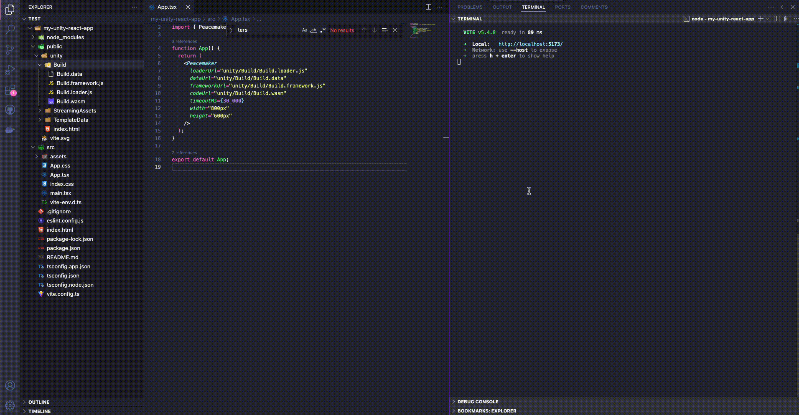

## Peacemaker Unity React SEI SDK

Peacemaker SDK integrates Unity WebGL with Sei blockchain. Enables initiating transactions from within Unity and receiving responses as callbacks.

## Installation

Install the package using npm:

```sh
npm install peacemaker-unity-react-sei-sdk
```

Also make sure you have all the required peer dependencies installed:

```sh
npm install @sei-js/core @sei-js/react react react-dom react-unity-webgl
```

To effectively use the integration you also have to have a crypto wallet such as Compass installed as an extension in your browser.

## Usage

### React bindings

Import the `Peacemaker` component from the package and wrap your Unity scene in it. Pass paths to the Unity WebGL files as props (`loaderUrl`, `frameworkUrl`, `codeUrl`, `dataUrl`).

```jsx
import { Peacemaker } from 'peacemaker-unity-react-sei-sdk';

export default function App() {
    return (
        <Peacemaker
            loaderUrl="unity/Build/Build.loader.js"
            dataUrl="unity/Build/Build.data"
            frameworkUrl="unity/Build/Build.framework.js"
            codeUrl="unity/Build/Build.wasm"
            timeoutMs={30_000}
            width="800px"
            height="600px"
        />
    );
}
```

Optionally, you can pass a `timeoutMs` prop to set the maximum time in milliseconds to wait for user's response to authentication request. Default is 30 seconds.

You can also set a custom size of your Unity scene by passing `width` and `height` string props as in the example above.

### Unity C# bindings

The instructions for configuring your Unity project and using C# API can be found in the [following repository](https://https://github.com/ISTechLabs/SeiUnitySDK).

## React Project Example

Example of creating a React project with Vite and using the `Peacemaker` component:

### 1. Create Vite project

```sh
npm create vite@latest my-unity-react-app
```

Then chose React and then Typescipt in the CLI prompt.

### 2. Install dependencies

```sh
cd my-unity-react-app
npm install
```

### 3. Install Peacemaker

```sh
npm install peacemaker-unity-react-sei-sdk
npm install @sei-js/core @sei-js/react react react-dom react-unity-webgl
```

### 4. Move your Unity WebGL files into the Vite project

Create a `unity` folder in the `src/public` directory of your project and move your Unity WebGL files (`Build.loader.js`, `Build.data`, `Build.framework.js`, `Build.wasm`) into it.

### 5. Add Peacemaker component to your app

Open `src/App.tsx` file, remove all the content and add the following code instead:

```jsx
import './App.css';
import { Peacemaker } from 'peacemaker-unity-react-sei-sdk';

function App() {
    return (
        <Peacemaker
            loaderUrl="unity/Build/Build.loader.js"
            dataUrl="unity/Build/Build.data"
            frameworkUrl="unity/Build/Build.framework.js"
            codeUrl="unity/Build/Build.wasm"
            timeoutMs={30_000}
            width="800px"
            height="600px"
        />
    );
}

export default App;
```

Ensure that paths and casing are correct and match Unity WebGL files mentioned in the previous step.

### 6. Run the app

Start Vite in development mode:

```sh
npm run dev
```

then go to `http://localhost:5173` in your browser.

If you are using an example Unity project found in the C# SDK repository, you will see an example Unity scene with a `Login` button in it. Once you click it, you will be redirected to the Compass Sei Wallet to authenticate your account. After you login, you will see a message in Unity console with your account address.

## Demo



## Limitations

Note that this package is still in development, there is still a lot to do to fully support an effective integration. Reach out on github in case of any issues.
